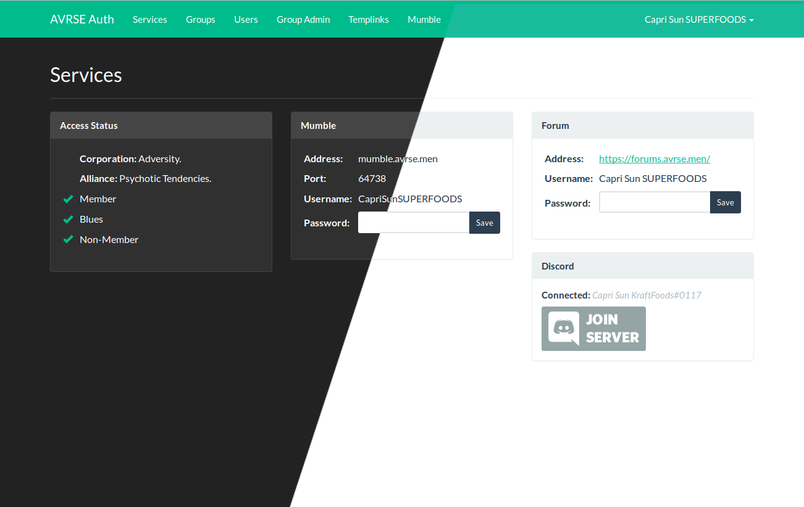

# AVRSE Auth

AVRSE auth is an EVE Online auth system originally created for TISHU/Adversity, but that I'm happy to release publically so that others may use it. As it's created for a single alliance the basic features and functionality are heavily tailored towards how we run our group, but if it's a good fit for you too then you're welcome to use it.

While I will likely add features as needed for our own usage over time, it currently lacks any scraping of data from the EVE API beyond checking the member's corp alliance. It's not designed to be a big brother-style entity, just a basic but super robust and reliable tool for locking down your mumble and discord server. The \#1 goal of this project is to provide automated information security and all other considerations are secondary.

## Features
* SSO Login
* Groups with granular permissions
* Multiple membership levels (Member, Blues, Non-member) defined in config file by Corp and Alliance
* Updates all members hourly
* Light/Dark mode

## Integrations
### Discord
* Authenticates all users against the auth service
* Connects auth accounts to Discord using Discord's SSO
* Shares membership level, corp and auth groups as groups on the Discord server
* Instantly kicks users when they drop below the required membership level

### Mumble
* Authenticates all users against the auth service
* Only allows users with the defined membership level to connect
* Fixed name schema (eg. "#HRDKX - Capri Sun KraftFoods")
* Logs last connection time against a user
* Auto afk script, moves users to afk channel after 20 minutes of being deafened or 2 hours no activity
* [Basic Admin Panel](https://i.imgur.com/X50dOPJ.png)
* Temporary link functionality (tags and kicks all users when the templink is deleted/expires)

### IPBoard
* Authenticates all users against the auth service
* Sets membership level as primary group
* Doesn't handle secondary groups at the moment (no corp/alliance/auth groups)
